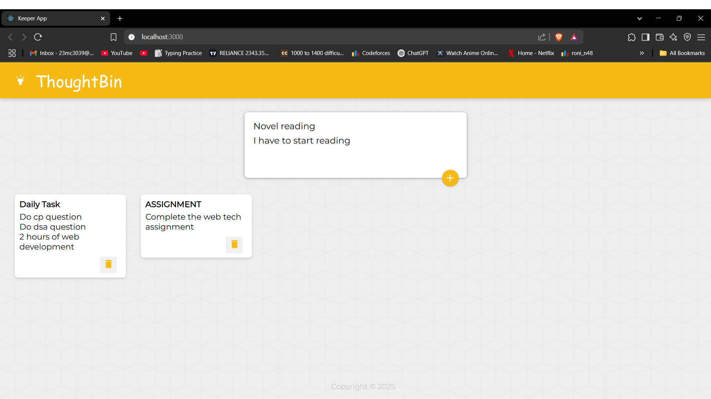

# 📝 ThoughtBin - A Lightweight Note-Taking App

ThoughtBin is a minimal, fast, and user-friendly note-taking web app inspired by Google Keep. It allows you to create, store, and manage your notes in a clean and responsive interface.

## 🚀 Features

- 📌 Create and save unlimited notes
- 🎨 Color-coded notes
- 🗑️ Delete and archive functionality
- 🔍 Search through notes
- 🧭 Responsive layout

## 🖼️ Screenshot



## 🛠️ Tech Stack

- **Frontend**: HTML, CSS, JavaScript
- **Framework**: React.js
- **State Management**: React Hooks
- **Styling**: CSS Modules or Vanilla CSS

## 📦 Installation

1. Clone the repo:
   ```bash
   git clone https://github.com/your-username/your-repo-name.git
